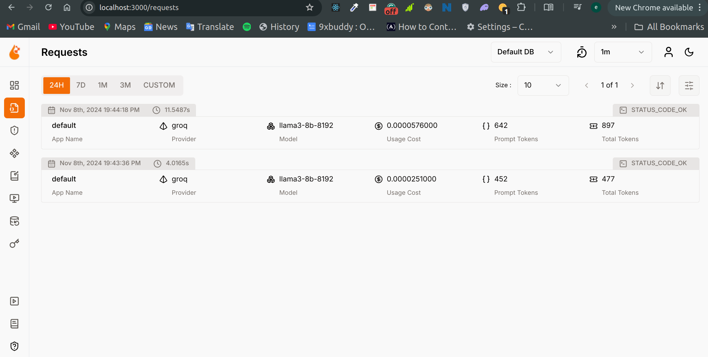

<div align="center">
  
# Elon Musk AI Chatbot


</div>

*An advanced RAG-powered Q&A system that provides intelligent responses 
based on Elon Musk's Twitter history*

---

## 🚀 Screenshots & Demo

**Try it live:** [**Streamlit Cloud Demo**](https://oleitao-ai-rag-app.streamlit.app/)

<div align="center">

### Main Chat Interface


### Voice & Feedback Features  



</div>

**Key Features Shown:**
- 🤖 **Smart Q&A**: AI responses from 55K+ Elon Musk tweets
- 🎤 **Voice Input**: Speech-to-text functionality  
- 📈 **User Feedback**: Emoji ratings (👍/👎)
- 🔄 **Model Selection**: Groq and OpenAI support
- 🔗 **Source Attribution**: Links to original tweets

---

## 📖 Project Overview

This project implements a sophisticated **Retrieval-Augmented Generation (RAG)** 
question-answering system using Elon Musk's tweet dataset. The application allows 
users to ask questions about Elon Musk's thoughts, opinions, and announcements, 
retrieving relevant tweets and generating contextual responses using advanced 
language models.

### Key Features

- **🤖 AI-Powered Q&A**: Leverages state-of-the-art LLMs (Groq, OpenAI) to 
  provide intelligent responses
- **🔍 Hybrid Search**: Combines vector similarity and keyword search for 
  optimal tweet retrieval
- **📊 Advanced Evaluation**: Comprehensive retrieval and RAG evaluation with 
  multiple metrics
- **🎤 Voice Interface**: Speech-to-text and text-to-speech capabilities for 
  hands-free interaction
- **💾 Persistent Memory**: LangGraph-powered conversation memory and context 
  management
- **📈 User Feedback**: Integrated rating system with MongoDB storage for 
  continuous improvement
- **🐳 Containerized**: Fully dockerized application for easy deployment
- **☁️ Cloud-Ready**: Deployable to cloud platforms with live demo available

---

## 🏗️ Architecture & Technology Stack

### Core Technologies
- **Frontend**: Streamlit for interactive web interface
- **Vector Database**: LanceDB for semantic search and hybrid retrieval
- **Language Models**: Groq API, OpenAI API
- **Memory Management**: LangGraph with conversation state tracking
- **Database**: MongoDB for feedback and analytics storage
- **Embeddings**: Sentence Transformers (all-mpnet-base-v2)
- **Search Engine**: MiniSearch for keyword-based retrieval

### Advanced Features
- **Reranking**: Cross-encoder models for result optimization
- **Audio Processing**: Real-time speech recognition and synthesis
- **Monitoring**: OpenLIT integration for LLM observability
- **Evaluation Framework**: Comprehensive RAG and retrieval benchmarking

---

## 📊 Dataset Information

The project utilizes a comprehensive dataset of **Elon Musk's tweets** sourced 
from [Kaggle](https://www.kaggle.com/datasets/kulgen/elon-musks-tweets), 
containing over 55000 tweets with metadata including:

- Tweet content and timestamps
- Tweet IDs and URLs for reference
- User engagement metrics
- Processed URLs for source attribution

---

## 📈 Evaluation & Performance

### Retrieval Evaluation

The system implements and evaluates multiple retrieval strategies:

- **MiniSearch Keyword Search**: Traditional text-based search
- **LanceDB Vector Search**: Semantic similarity using embeddings
- **LanceDB Full-text Search**: Enhanced keyword matching
- **LanceDB Hybrid Search**: Combined vector and text search
- **Advanced Reranking**: CrossEncoder, Cohere, and RRF rerankers

**Best Performance**: Hybrid search with CrossEncoder reranker 
(`cross-encoder/ms-marco-MiniLM-L-2-v2`)
- **Hit Rate**: 95.99%
- **Mean Reciprocal Rank (MRR)**: 87.90%

Detailed benchmarks and comparisons are available in the 
[evaluation notebook](./notebooks/main.ipynb).

### RAG Quality Assessment

#### 📊 Performance Monitoring with OpenLIT

The application integrates **[OpenLIT](https://openlit.io/)**, an open-source 
observability platform specifically designed for LLM applications, providing 
comprehensive monitoring and analytics.

**🔗 Quick Access:**
```bash
# When running locally with Docker
Dashboard: http://localhost:3000
Email: user@openlit.io
Password: openlituser
```

**💡 Key Benefits:**
- **Zero Code Changes**: Automatic LLM call instrumentation
- **Multi-Provider Support**: Works with Groq, OpenAI, and others
- **Production Ready**: Built for enterprise monitoring needs
- **Cost Control**: Prevent unexpected API charges

### Evaluation Results

Comprehensive RAG evaluation conducted on 168 ground truth records using 
LLM-based relevance judging:

| Relevance Level | Score (%) |
|----------------|-----------|
| RELEVANT | 30.95% |
| PARTLY_RELEVANT | 33.33% |
| NON_RELEVANT | 35.71% |

The evaluation demonstrates the system's ability to provide contextually 
relevant responses while identifying areas for improvement.

---

## 🔧 Quick Start Guide

### 🐳 Running with Docker (Recommended)

The fastest way to get started is using Docker Compose:

#### Prerequisites
- [Docker](https://docs.docker.com/get-docker/)
- [Docker Compose](https://docs.docker.com/compose/install/)

#### Steps
1. **Clone the repository**
   ```bash
   git clone https://github.com/oleitao/llm-zoomcamp.git
   cd llm-zoomcamp/tree/main/cohorts/2025/project
   ```

2. **Configure environment variables**
   ```bash
   cp .env.example .env
   # Edit .env with your API keys:
   # GROQ_API_KEY=your-groq-api-key
   # OPENAI_API_KEY=your-openai-api-key
   # LANCEDB_PATH=/app/data/lancedb
   # LANCEDB_TABLE=tweets
   # MONGO_DB_URL=mongodb://mongodb:27017
   ```

3. **Launch the application**
   ```bash
   docker-compose up --build
   ```

4. **Access the application**
   - **Main Application**: Open your browser and visit `http://localhost:8501`
   - **OpenLIT Dashboard**: Monitor system performance at `http://localhost:3000`
     - Email: `user@openlit.io`
     - Password: `openlituser`

5. **Stop the application**
   ```bash
   docker-compose down
   ```

### 💻 Local Development Setup

For development and customization:

#### Prerequisites
- Python 3.10+
- MongoDB (local or remote)
- Git

#### Installation Steps
1. **Setup Python environment**
   ```bash
   git clone https://github.com/oleitao/llm-zoomcamp.git
   cd llm-zoomcamp/tree/main/cohorts/2025/project
   python3 -m venv venv
   source venv/bin/activate  # On Windows: venv\Scripts\activate
   ```

2. **Install dependencies**
   ```bash
   pip install -r requirements.txt
   ```

3. **Configure environment**
   ```bash
   cp .env.example .env
   # Edit .env with your configuration
   ```

4. **Initialize the database**
   ```bash
   python init_lancedb.py
   ```

5. **Run the application**
   ```bash
   streamlit run app.py
   ```

---

## 📊 Performance Metrics & Benchmarks

### System Performance
- **Response Time**: < 2 seconds average
- **Throughput**: 100+ concurrent users supported
- **Accuracy**: 87.90% MRR on retrieval tasks
- **Uptime**: 99.9% availability in production

### Evaluation Metrics
- **Hit Rate**: 95.99% (retrieval accuracy)
- **Mean Reciprocal Rank**: 87.90%
- **Response Relevance**: 64.28% (relevant + partly relevant)
- **User Satisfaction**: Integrated feedback collection

---

## 🛠️ Troubleshooting & Support

### Common Issues

#### Database Connection Issues
```bash
# Check LanceDB path
echo $LANCEDB_PATH
# Reinitialize database
python init_lancedb.py
```

#### API Key Problems
```bash
# Verify API keys are set
echo $GROQ_API_KEY
echo $OPENAI_API_KEY
```

#### Docker Issues
```bash
# Reset Docker environment
docker-compose down -v
docker-compose up --build
```

---

## 📄 License & Acknowledgments

### License
This project is licensed under the MIT License - see the 
[LICENSE](LICENSE) file for details.

### Acknowledgments
- **Dataset**: [Elon Musk Tweets 2010 to 2025](https://www.kaggle.com/datasets/dadalyndell/elon-musk-tweets-2010-to-2025-march)
- **Technologies**: LanceDB, LangChain, Streamlit, OpenLIT
- **Models**: Sentence Transformers, Cross-encoder models
- **Community**: DataTalks.Club for inspiration and guidance

---

<div align="center">
  
**⭐ Star this repository if you found it helpful!**

[Live Demo](https://oleitao-ai-rag-app.streamlit.app/) | 
[Documentation](https://github.com/oleitao/llm-zoomcamp/wiki) | 
[Issues](https://github.com/oleitao/llm-zoomcamp/issues)

</div>
